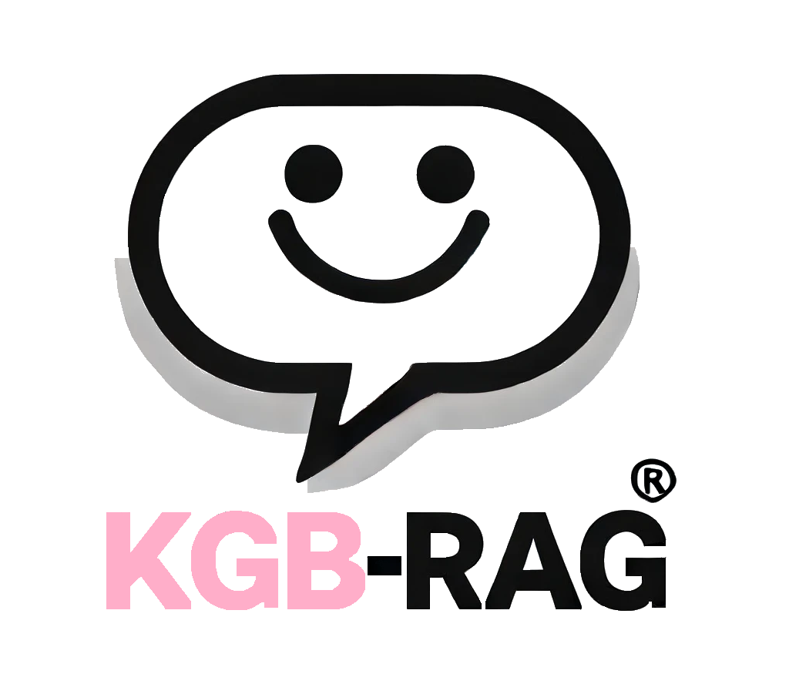
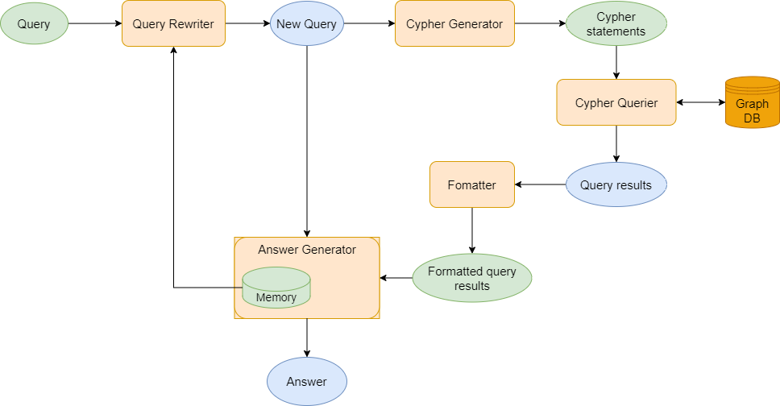
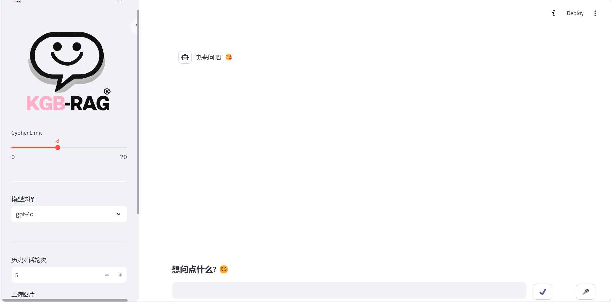

# KGB-RAG(Knowledge Graph-based Retrieval-Augmented Generation)

<p align="center"></p>


KGB-RAG是一个基于neo4j图数据库和其他图数据库的知识图谱检索系统，它可以根据用户的自然语句提问，从原数据库获取相关实体信息，并通过知识图谱检索技术以及结合大模型自身能力来增强回答用户的自然语言提问。

## 目录

* [介绍](README.md#介绍)
* [解决的痛点](README.md#解决的痛点)
* [运行流程](README.md#运行流程)
* [使用](README.md#使用)
* [扩展](README.md#扩展)


## 介绍

KGB-RAG是一个基于[Langchain](https://github.com/langchain-ai/langchain)与[Streamlit](https://streamlit.io/)，不同于传统的知识图谱嵌入，它采用的抓取实体、从数据库中获取相关信息的方式，可以更好地获取到实体的上下文信息，并通过实体关系的推理，生成问答对。下面是一些关于KGB-RAG的主要功能：

1. 能够采用图片、音频、文本多模态的输入方式进行提问，且不同模态互不冲突，可以用音频+文本的方式进行提问等.

2. 可连接到不同的neo4j数据库，而且只需在改变连接后改变查询提供的Schema即可，详情见**使用**部分；甚至可以改用其他类型数据库(例如关系式数据库)，只需做一些重写即可，详情见**扩展**部分.

3. 可在不同环节使用不同的大模型(包括本地模型或者远程的流行大模型调用API)，设置详情见**使用**部分.

4. 在提问之后，系统抽取实体并生成对应的Cypher语句，能够较为准确返回Query语句中包含的实体相关信息.

5. 系统能够根据图谱与大模型能力生成Query对应答案，并且对于私人知识图谱也有良好召回效果，同时及时与图谱完全无关的提问也能得到答案.

## 解决的痛点

#### 1.个性化需求
很多用户希望利用自己的私有数据进行个性化问答。KGB-RAG能够非常好地利用私人图谱，将用户的私有数据整合到知识图谱中，从而提供更加个性化的回答，满足用户的个性化需求。

#### 2.信息检索效率
在传统的基于关键字的搜索系统中，用户需要准确地知道要搜索的信息并使用正确的关键字。而KGB-RAG通过自然语言处理技术，允许用户使用自然语言进行提问，系统可以自动解析并理解用户的问题，检索相关信息，极大地提高了信息检索的效率和准确性。

#### 3.复杂查询
复杂的查询通常涉及多个实体和关系，在传统的数据库中需要编写复杂的查询语句。KGB-RAG通过图数据库的强大查询能力，能够高效处理涉及多实体和多关系的复杂查询，并通过自然语言提问来简化用户的操作。

#### 4.时效性
传统的静态知识库难以及时更新和维护，导致回答时效性差。KGB-RAG使用图数据库的动态更新能力，使得知识图谱可以随时更新，保证回答的时效性和准确性。


## 运行流程
本项目的基本原理如下图所示，过程包括:输入问题(多种模态输入)->改写问题->生成查询语句->查询图谱->格式化数据->将问题与查询信息结合发给大模型->大模型结合材料和自身能力生成答案->输出答案。


项目的实际核心就是五个器，见下解释，我们团队对它们进行了解耦和封装，体现在module与api两个py文件中。

**改写问题部分(Query Rewriter)**:该部分会利用大模型对于上下文历史和自身的能力把问题详细化，使得问题更加准确。

**生成查询语句部分(Cypher Generator)**:该部分大模型会根据改写过后的问题以及给定的模式，生成查询语句。

**查询图谱部分(Cypher Querier)**:该部分不利用大模型，直接利用图数据库的查询能力，查询出与问题相关的实体和关系。

**格式化数据部分(Fomatter)**:该部分会将图数据库查询出的数据格式化，使得大模型能够更好理解图谱信息。

**生成答案部分(Answer Generator)**:该部分会将问题与查询信息结合发给大模型，大模型结合材料以及上下文历史信息和自身能力生成答案。

**注意**:若生成查询语句的结果为空，则直接调用大模型；若查询图谱的结果为空，也直接调用大模型。因为这都说明问题与图谱无关，需要调用大模型来生成答案。

## 使用

### 1.环境配置
+ 首先，确保你的机器安装了 Python 3.8 - 3.11。这里的情况根据不同的neo4j版本或者其他图数据库的不同版本而定，因为不同图数据库的python驱动可能不同。我们一般建议安装python 3.9及以上版本。

```
$ python --version
Python 3.9.19
```

接着，创建一个虚拟环境，并将项目代码clone到本地，在虚拟环境内安装项目的依赖。

```shell

# 进入目录
$ cd KGB-RAG

# 安装全部依赖
$ pip install -r requirements.txt #该项目依赖安装较简单，若出现报错，安装缺少依赖即可。

# 安装图数据库的python驱动(这里以neo4j为例，版本根据不同的图数据库版本而定)
$ pip install neo4j==x.x.x
```

### 2.连接图数据库

+ KGB-RAG的基本功能支持连接neo4j数据库(可扩展到其他图数据库，见**扩展**部分)。
首先，确保你已经安装了neo4j数据库，并启动了服务，以及安装了对应的正确的python驱动。接着你需要在config/neo4j.config.py文件下更改对应的端口、密码等等。

完成基本连接之后你需要将目光看到graph_database.py文件中，里面有node_properties_query、rel_properties_query、rel_query三个函数里面分别写了查询节点、关系、关系属性的语句，你需要自己利用这些语句在数据库进行查询之后，把这些查询结果拼接，然后利用自己利用大模型按照项目已经写好的prompt(在prompt.py的REFORMATTED_SCHEMA中)进行提问，把返回的Schema填入到prompt.py文件中的**SCHEMA**这一项中.

### 3.连接大模型
对于你要使用的大模型，将你个人的API_KEY和想用的model—_name填入到config文件夹中的各文件中，目前支持通义、Chat-GPT、智谱，其他扩展见**扩展**部分。

**注意**:本项目在重写询问和生成查询语句都固定使用GPT-4o(为了查询生成的准确性)，所以使用者一定需要在config中openai的配置文件中填入API_KEY，我们本项目的模型更改体现在后面几个环节。普通对话模块中的openai_config.py中的url需要根据自己使用的url进行修改。

**图片模态功能说明**:其中图片的功能是在上传图片后一直保留，若不需要带着图片提问，需要将图片在左侧的输入框中删除，以及图片模态功能暂时是直接与大模型提问，因为用图片模态提问大模型有关图谱的问题效果极差，所以图片功能暂时为直接对话。图片模块中的image_analyze/openai.py中的url需要根据自己使用的url进行修改。

### 4.运行项目

```shell
# 进入目录
$ cd KGB-RAG

# 运行项目的Web_ui
$ streamlit run web_ui.py
```

如果正常启动，你将能看到以下界面:

接着就可以正常使用不同的方式提问。

## 扩展

### 1.扩展图数据库
KGB-RAG的图数据库连接部分暂时支持neo4j，若要扩展到其他图数据库，需要在config文件中添加新的数据库的config文件，并在graph_database.py中对GraphData进行部分重写即可。

除此之外，若需要对关系式数据库或者键值对等等数据库进行连接，需要自己添加config文件，并对连接的函数与类进行重写，之后再把数据库对应的Schemata填入到prompt.py的**SCHEMA**中即可。

### 2.扩展大模型
KGB-RAG的大模型连接部分暂时支持通义、Chat-GPT、智谱，若要扩展到其他大模型，需要在config文件夹中添加新的大模型的config文件，然后检查该大模型是否已经用langchain框架进行了封装，若没有，则需要自己进行封装，并在前端和api等文件中进行修改即可(注释较为详细,具体可参考)。

若需要部署本地的大模型，可以在[HuggingFace](https://huggingface.co/models)等平台上下载模型，然后按环境部署模型，之后则是一样在config文件夹中添加新的大模型的config文件，自己使用langchain框架进行封装，并在前端和api等文件中进行修改即可(注释较为详细,具体可参考)。